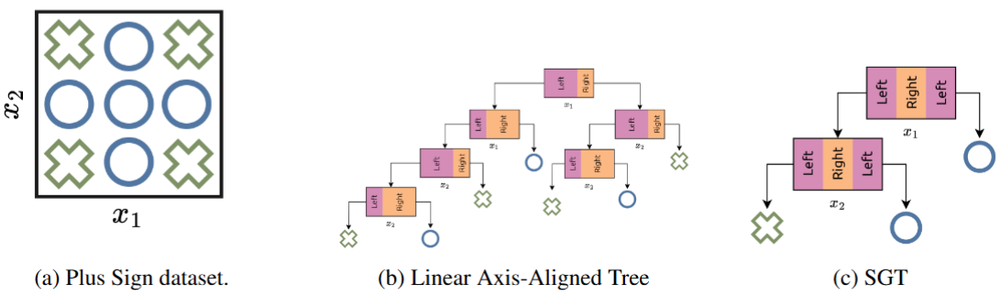

# SGTLearn


`sgtlearn` is a Python package for learning [Shape Generalized Trees (SGTs)](https://neurips.cc/virtual/2025/loc/san-diego/poster/115950)!

- 🌳 **Shape Generalized Trees (SGTs):** A new class of decision trees where each node applies a learnable, axis-aligned *shape function* to a feature, enabling non-linear and interpretable splits.  
- 👁 **Interpretability:** Each node’s shape function can be directly visualized, providing intuitive, visual explanations of the model’s decision process.  
- ⚡ **ShapeCART Algorithm:** An efficient induction method for learning SGTs from data.  
- 🔀 **Extensions:**  
  - **Shape²GT (S²GT):** Bivariate shape functions for richer splits.  
  - **SGT<sub>K</sub>:** Multi-way branching generalization.  
  - **Shape²CART & ShapeCART<sub>K</sub>:** Algorithms for learning S²GTs and SGT<sub>K</sub>s.  
  - ShapeCART extensions for both variants. 

## Installation

### From Source

Clone the repository and install in development mode:

```bash
git clone https://github.com/yourusername/sgt-learn.git
cd sgt-learn
pip install -e .
```

### For Development

Install with development dependencies:

```bash
pip install -e ".[dev]"
```

## Dependencies

This package requires:
- pandas
- numpy
- scikit-learn
- scipy
- tqdm
- networkx
- matplotlib

## Quick Start

```python
from sgtlearn import ShapeCARTClassifier

# Create an instance
model = ShapeCARTClassifier()

# Fit the model
model.fit(X_train, y_train)

# Make predictions
predictions = model.predict(X_test)
```


## License

MIT License - see [LICENSE](LICENSE) file for details.

## Contributing

Contributions are welcome! Please feel free to submit a Pull Request.

## Citation
If you use this package in your research, please cite:

```
@inproceedings{upadhyaempowering,
  title={Empowering Decision Trees via Shape Function Branching},
  author={Upadhya, Nakul and Cohen, Eldan},
  booktitle={The Thirty-ninth Annual Conference on Neural Information Processing Systems},
  year={2025}
}
```

Additionally, check out our other works on our [lab website.](https://optimal.mie.utoronto.ca/)
